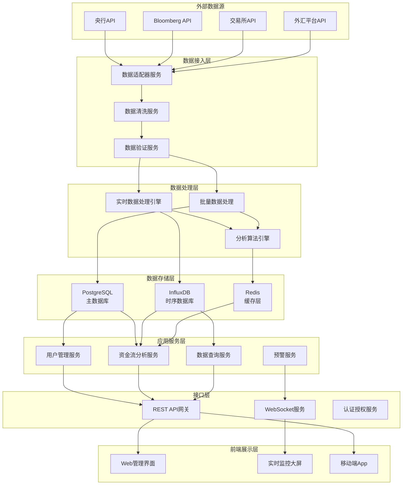
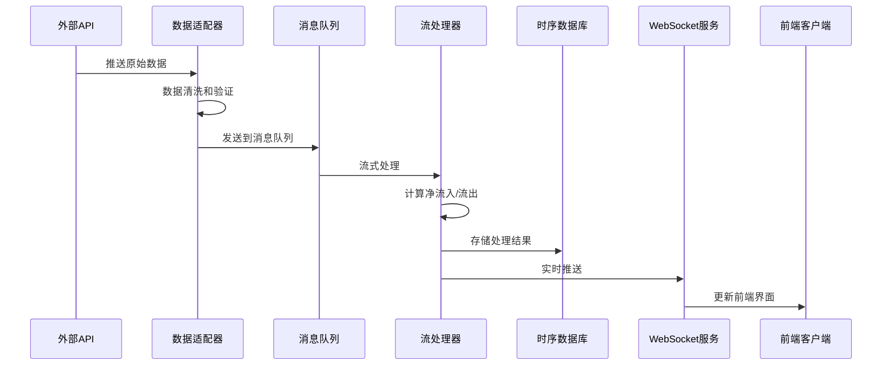
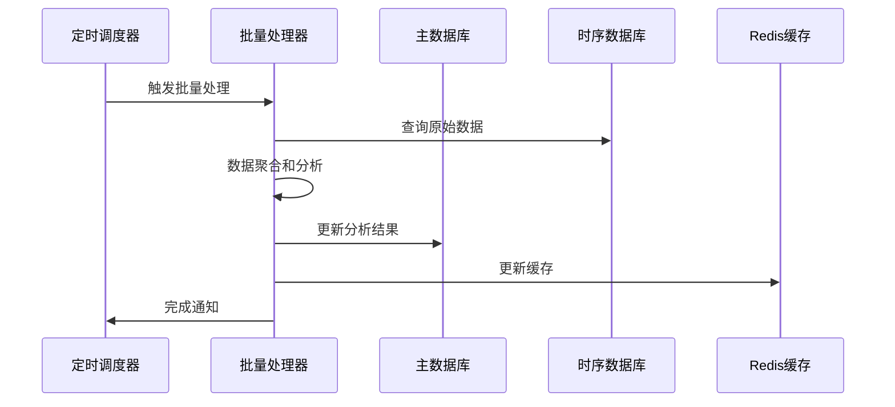
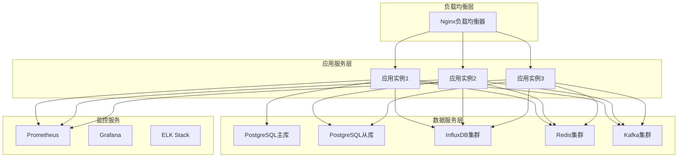

# 全球资金流动监控系统 - 系统设计文档

## 设计概述

### 业务目标
基于需求分析，本系统旨在提供实时、准确、全面的全球资金流动监控和分析平台，支持多维度数据分析、智能预警和历史数据查询。

### 设计原则
- **高可用性**: 99.9%系统可用性，支持7x24小时运行
- **高性能**: API响应时间<1秒，支持10,000+TPS处理能力
- **可扩展性**: 支持水平扩展，适应数据量和用户量增长
- **数据准确性**: 多源数据验证，准确率>99.5%
- **安全可靠**: 端到端加密，完整的审计日志

## 系统架构

### 整体架构图



### 架构分层说明

#### 1. 外部数据源层
**职责**: 提供全球资金流动的原始数据
- **央行数据**: 美联储、欧央行、中国人民银行等官方数据
- **金融数据供应商**: Bloomberg、Reuters、Alpha Vantage等
- **交易所数据**: 主要证券交易所、外汇交易平台
- **第三方服务**: 经济数据、新闻事件等补充数据

#### 2. 数据接入层
**职责**: 数据采集、清洗、验证和标准化
- **数据适配器**: 适配不同数据源的接口格式
- **数据清洗**: 去重、格式转换、异常值处理
- **数据验证**: 多源数据交叉验证、质量检查

#### 3. 数据处理层
**职责**: 实时和批量数据处理、分析计算
- **实时处理引擎**: 基于Apache Kafka Streams的流处理
- **批量处理**: 定时批量数据处理和历史数据分析
- **分析算法引擎**: 净流入/流出计算、趋势分析、异常检测

#### 4. 数据存储层
**职责**: 数据持久化和缓存
- **PostgreSQL**: 主数据库，存储用户、配置、元数据
- **InfluxDB**: 时序数据库，存储资金流动时序数据
- **Redis**: 缓存层，提高查询性能和会话管理

#### 5. 应用服务层
**职责**: 核心业务逻辑实现
- **用户管理**: 用户认证、权限管理、个性化配置
- **资金流分析**: 多维度数据分析、统计计算
- **预警服务**: 实时监控、异常检测、通知推送
- **数据查询**: 历史数据查询、报表生成

#### 6. 接口层
**职责**: 对外提供标准化接口
- **REST API**: RESTful接口，支持CRUD操作
- **WebSocket**: 实时数据推送接口
- **认证授权**: OAuth 2.0、JWT token管理

#### 7. 前端展示层
**职责**: 用户界面和数据可视化
- **Web管理界面**: 基于React的管理控制台
- **实时监控大屏**: 实时数据展示和图表
- **移动端**: 移动应用支持

## 技术选型

### 后端技术栈

#### 框架层
- **Spring Boot 3.5.4**: 主应用框架
- **Spring Security**: 安全认证和授权
- **Spring Data JPA**: 数据访问层
- **Spring WebFlux**: 响应式编程支持

#### 数据库
- **PostgreSQL 15+**: 主数据库
  - 用户数据、系统配置、元数据
  - 支持JSON字段存储复杂配置
- **InfluxDB 2.0+**: 时序数据库
  - 资金流动时序数据
  - 高性能时间序列查询
- **Redis 7.0+**: 缓存和会话
  - 热点数据缓存
  - 分布式锁
  - WebSocket会话管理

#### 消息队列
- **Apache Kafka**: 高吞吐量消息队列
  - 实时数据流处理
  - 事件驱动架构
  - 数据解耦和缓冲

#### 监控和日志
- **Micrometer + Prometheus**: 应用监控
- **Grafana**: 监控数据可视化
- **ELK Stack**: 日志收集和分析
- **Zipkin**: 分布式链路追踪

### 前端技术栈
- **React 18**: 用户界面框架
- **TypeScript**: 类型安全的JavaScript
- **Ant Design**: UI组件库
- **ECharts**: 数据可视化图表
- **Socket.io**: WebSocket客户端

### 部署技术栈
- **Docker**: 容器化部署
- **Kubernetes**: 容器编排
- **Nginx**: 反向代理和负载均衡
- **Let's Encrypt**: SSL证书管理

## 核心组件设计

### 1. 数据采集组件

#### DataSourceAdapter（数据源适配器）
```java
@Component
public interface DataSourceAdapter {
    /**
     * 采集数据
     * @param config 数据源配置
     * @return 原始数据流
     */
    Flux<RawDataPoint> collectData(DataSourceConfig config);
    
    /**
     * 健康检查
     */
    boolean isHealthy();
    
    /**
     * 获取支持的数据类型
     */
    Set<AssetType> getSupportedAssetTypes();
}
```

#### 具体实现类
- `BloombergAdapter`: Bloomberg API适配器
- `CentralBankAdapter`: 央行数据适配器
- `ExchangeAdapter`: 交易所数据适配器
- `ForexAdapter`: 外汇数据适配器

### 2. 数据处理组件

#### StreamProcessor（流处理器）
```java
@Service
public class CashFlowStreamProcessor {
    
    /**
     * 实时计算净流入/流出
     */
    @EventListener
    public void processRealTimeData(DataStreamEvent event) {
        // 1. 数据验证
        // 2. 净流入/流出计算
        // 3. 异常检测
        // 4. 结果存储
        // 5. 实时推送
    }
    
    /**
     * 批量数据处理
     */
    @Scheduled(fixedRate = 300000) // 5分钟
    public void processBatchData() {
        // 1. 数据聚合
        // 2. 趋势分析
        // 3. 历史数据更新
    }
}
```

### 3. 分析引擎组件

#### CashFlowAnalyzer（资金流分析器）
```java
@Service
public class CashFlowAnalyzer {
    
    /**
     * 计算净流入/流出
     */
    public NetFlowResult calculateNetFlow(AssetType assetType, 
                                         TimeRange timeRange) {
        // 基于FR-004中定义的统计方法论实现
        return null;
    }
    
    /**
     * 多维度分析
     */
    public MultiDimensionAnalysis analyzeByDimension(
        AssetType assetType, 
        Region region, 
        TimeRange timeRange) {
        // 实现US-002B的多维度分析需求
        return null;
    }
    
    /**
     * 异常检测
     */
    public List<AnomalyEvent> detectAnomalies(AssetType assetType) {
        // 实现US-003的智能预警功能
        return null;
    }
}
```

### 4. 数据模型设计

#### 核心实体类

```java
// 资产类型枚举
public enum AssetType {
    STOCK("股票"),
    BOND("债券"), 
    FOREX("外汇"),
    COMMODITY("大宗商品"),
    REAL_ESTATE("房地产"),
    CRYPTOCURRENCY("加密货币"),
    CASH_EQUIVALENT("现金类资产"),
    ALTERNATIVE("另类投资"),
    SPOT_TRADING("现货贸易");
}

// 资金流动实体
@Entity
@Table(name = "cash_flows")
public class CashFlow {
    @Id
    private String id;
    
    @Enumerated(EnumType.STRING)
    private AssetType assetType;
    
    private String subCategory; // 细分类别
    private BigDecimal netInflow; // 净流入金额（美元）
    private BigDecimal totalVolume; // 总交易量
    private String region; // 地区
    private String currency; // 币种
    private LocalDateTime timestamp; // 时间戳
    private String dataSource; // 数据来源
    
    // getters, setters, 构造函数...
}

// 分析结果实体
@Entity
@Table(name = "analysis_results")
public class AnalysisResult {
    @Id
    private String id;
    
    @Enumerated(EnumType.STRING)
    private AssetType assetType;
    
    private String analysisType; // 分析类型
    private Map<String, Object> metrics; // 分析指标
    private LocalDateTime calculatedAt; // 计算时间
    private String methodology; // 计算方法论
    
    // getters, setters...
}
```

## API设计

### REST API接口设计

#### 1. 资产类别分析接口（US-002B实现）

```http
GET /api/v1/cash-flows/assets/{assetType}
```

**参数说明:**
- `assetType`: 资产类别（STOCK, BOND, FOREX等）
- `region`: 地区筛选（可选）
- `timeRange`: 时间范围（可选）
- `subCategory`: 子类别筛选（可选）

**响应示例:**
```json
{
  "success": true,
  "data": {
    "assetType": "STOCK",
    "summary": {
      "netInflow": 1500000000,
      "totalVolume": 50000000000,
      "flowIntensity": 3.0,
      "lastUpdated": "2025-01-17T10:30:00Z"
    },
    "breakdown": {
      "byMarketCap": {
        "largeCap": 800000000,
        "midCap": 500000000,
        "smallCap": 200000000
      },
      "byStyle": {
        "growth": 900000000,
        "value": 600000000
      },
      "bySector": [
        {"sector": "Technology", "netInflow": 400000000},
        {"sector": "Healthcare", "netInflow": 300000000}
      ]
    },
    "methodology": {
      "calculation": "net_inflow = total_buy_amount - total_sell_amount",
      "dataSource": ["NYSE", "NASDAQ", "LSE"],
      "updateFrequency": "30s"
    }
  }
}
```

#### 2. 实时数据推送接口

```http
GET /api/v1/cash-flows/realtime/{assetType}
```

**WebSocket接口:**
```javascript
// 连接WebSocket
const ws = new WebSocket('ws://api.example.com/ws/cash-flows');

// 订阅实时数据
ws.send(JSON.stringify({
  action: 'subscribe',
  assetTypes: ['STOCK', 'BOND'],
  regions: ['NORTH_AMERICA', 'EUROPE']
}));

// 接收实时更新
ws.onmessage = function(event) {
  const data = JSON.parse(event.data);
  // 处理实时数据更新
};
```

### 3. 历史数据查询接口（US-004实现）

```http
GET /api/v1/cash-flows/history
```

**参数说明:**
- `assetType`: 资产类别
- `startDate`: 开始日期
- `endDate`: 结束日期
- `granularity`: 数据粒度（1m, 5m, 1h, 1d）
- `format`: 导出格式（json, csv, excel）

## 数据流设计

### 实时数据流



### 批量数据流



## 性能优化设计

### 1. 数据库优化
- **分区策略**: 按时间分区存储时序数据
- **索引优化**: 为常用查询字段建立复合索引
- **读写分离**: 使用主从复制分离读写负载
- **连接池**: 配置合适的数据库连接池

### 2. 缓存策略
- **多层缓存**: 应用缓存 + Redis缓存 + CDN缓存
- **缓存预热**: 系统启动时预加载热点数据
- **缓存更新**: 使用消息队列异步更新缓存

### 3. 查询优化
- **数据预聚合**: 预计算常用的统计指标
- **查询分页**: 大结果集使用游标分页
- **异步处理**: 复杂查询使用异步处理

## 安全设计

### 1. 认证授权
- **OAuth 2.0**: 第三方认证集成
- **JWT Token**: 无状态身份验证
- **RBAC**: 基于角色的权限控制

### 2. 数据安全
- **传输加密**: 全链路HTTPS/WSS加密
- **存储加密**: 敏感数据AES-256加密存储
- **数据脱敏**: 日志和调试信息脱敏

### 3. 接口安全
- **API限流**: 防止API滥用
- **参数验证**: 严格的输入验证
- **SQL注入防护**: 使用参数化查询

## 监控和运维

### 1. 系统监控
- **应用监控**: JVM指标、接口响应时间
- **基础设施监控**: CPU、内存、磁盘、网络
- **业务监控**: 数据处理量、错误率、用户活跃度

### 2. 日志管理
- **结构化日志**: 使用JSON格式记录日志
- **日志分级**: DEBUG、INFO、WARN、ERROR
- **日志聚合**: ELK Stack集中日志管理

### 3. 告警机制
- **指标告警**: 基于Prometheus的告警规则
- **日志告警**: 基于关键词的日志告警
- **业务告警**: 数据异常、服务中断告警

## 部署架构

### 生产环境部署



### 容器化配置

#### Docker Compose示例
```yaml
version: '3.8'

services:
  app:
    build: .
    ports:
      - "8080:8080"
    environment:
      - SPRING_PROFILES_ACTIVE=prod
      - DATABASE_URL=jdbc:postgresql://postgres:5432/cashflow
    depends_on:
      - postgres
      - redis
      - influxdb

  postgres:
    image: postgres:15
    environment:
      POSTGRES_DB: cashflow
      POSTGRES_USER: cashflow
      POSTGRES_PASSWORD: ${DB_PASSWORD}
    volumes:
      - postgres_data:/var/lib/postgresql/data

  redis:
    image: redis:7-alpine
    command: redis-server --appendonly yes
    volumes:
      - redis_data:/data

  influxdb:
    image: influxdb:2.0
    environment:
      INFLUXDB_DB: cashflow_ts
      INFLUXDB_ADMIN_USER: admin
      INFLUXDB_ADMIN_PASSWORD: ${INFLUX_PASSWORD}
    volumes:
      - influx_data:/var/lib/influxdb2

volumes:
  postgres_data:
  redis_data:
  influx_data:
```

## 质量保证

### 1. 测试策略
- **单元测试**: 覆盖率>90%
- **集成测试**: 关键业务流程测试
- **性能测试**: 压力测试和基准测试
- **安全测试**: 渗透测试和漏洞扫描

### 2. 代码质量
- **代码规范**: 使用SpotBugs、Checkstyle
- **代码审查**: 必须的Pull Request审查
- **静态分析**: SonarQube代码质量检查

### 3. 持续集成
- **CI/CD**: GitHub Actions自动化流水线
- **自动测试**: 代码提交自动触发测试
- **自动部署**: 测试通过自动部署到测试环境

## 扩展性考虑

### 1. 水平扩展
- **无状态设计**: 应用服务无状态，支持水平扩展
- **数据库分片**: 时序数据按时间和资产类型分片
- **缓存集群**: Redis集群支持数据分片

### 2. 功能扩展
- **插件架构**: 支持新数据源快速接入
- **配置驱动**: 通过配置文件扩展功能
- **API版本**: 支持API版本管理和向后兼容

### 3. 国际化支持
- **多语言**: 支持中英文界面
- **多时区**: 支持不同时区的时间显示
- **多币种**: 支持多种货币单位显示

## 风险控制

### 1. 技术风险
- **数据源风险**: 多源数据备份，主从切换
- **性能风险**: 降级策略，限流保护
- **安全风险**: 定期安全评估，及时补丁更新

### 2. 业务风险
- **数据质量**: 多重验证，人工审核机制
- **合规风险**: 符合金融监管要求
- **用户体验**: A/B测试，用户反馈收集

### 3. 运维风险
- **备份策略**: 定期备份，异地容灾
- **监控覆盖**: 全面监控，及时告警
- **文档维护**: 完整的运维文档

## 总结

本设计文档基于已完成的需求分析，提供了全球资金流动监控系统的完整技术设计方案。设计遵循了高可用、高性能、可扩展的原则，采用了成熟的技术栈，确保系统能够满足业务需求并具备良好的可维护性。

**核心设计亮点:**
1. **分层架构**: 清晰的分层设计，职责分离
2. **微服务化**: 模块化设计，便于独立开发和部署
3. **实时处理**: 基于流处理的实时数据分析
4. **多源集成**: 灵活的数据源适配器架构
5. **性能优化**: 多层缓存和数据库优化策略
6. **安全保障**: 全面的安全设计和监控体系

**下一步工作:**
1. 基于本设计创建详细的任务分解清单
2. 制定开发计划和里程碑
3. 开始核心组件的开发实现