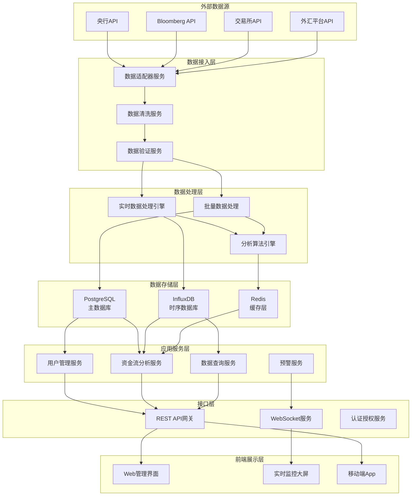
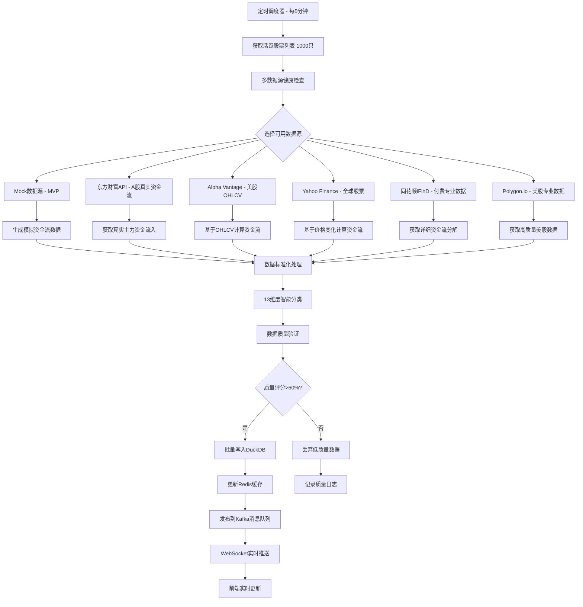
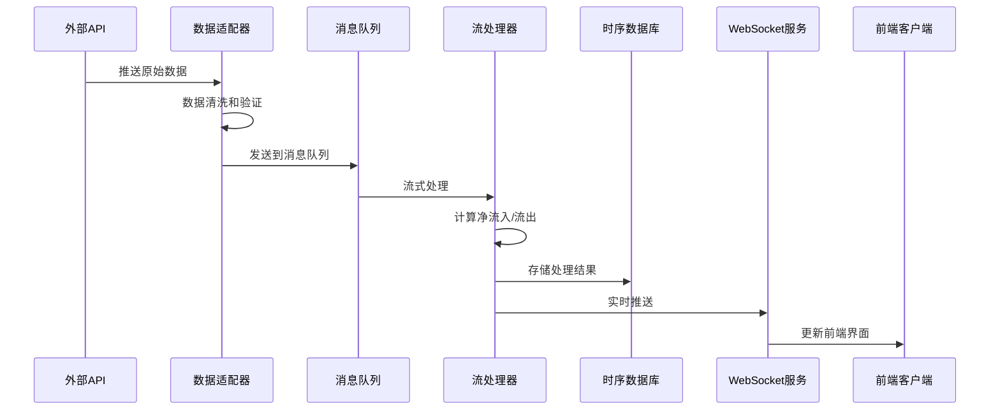
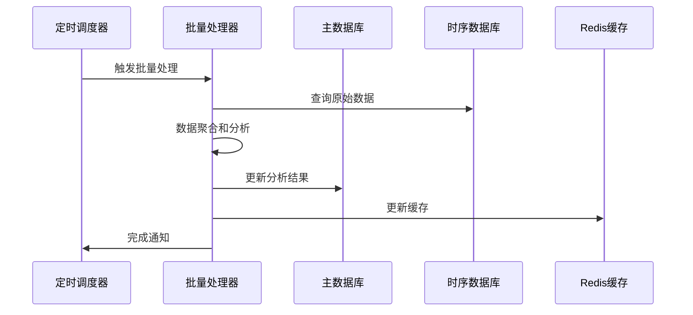
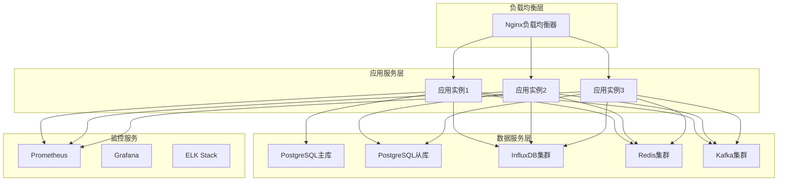

# 全球资金流动监控系统 - 系统设计文档

## 设计概述

### 业务目标
基于需求分析，本系统旨在提供实时、准确、全面的全球资金流动监控和分析平台，支持多维度数据分析、智能预警和历史数据查询。

### 设计原则
- **高可用性**: 99.9%系统可用性，支持7x24小时运行
- **高性能**: API响应时间<1秒，支持10,000+TPS处理能力
- **可扩展性**: 支持水平扩展，适应数据量和用户量增长
- **数据准确性**: 多源数据验证，准确率>99.5%
- **安全可靠**: 端到端加密，完整的审计日志

## 系统架构

### 整体架构图



### 架构分层说明

#### 1. 外部数据源层
**职责**: 提供全球资金流动的原始数据
- **央行数据**: 美联储、欧央行、中国人民银行等官方数据
- **金融数据供应商**: Bloomberg、Reuters、Alpha Vantage等
- **交易所数据**: 主要证券交易所、外汇交易平台
- **第三方服务**: 经济数据、新闻事件等补充数据

#### 2. 数据接入层
**职责**: 数据采集、清洗、验证和标准化
- **数据适配器**: 适配不同数据源的接口格式
- **数据清洗**: 去重、格式转换、异常值处理
- **数据验证**: 多源数据交叉验证、质量检查

#### 3. 数据处理层
**职责**: 实时和批量数据处理、分析计算
- **实时处理引擎**: 基于Apache Kafka Streams的流处理
- **批量处理**: 定时批量数据处理和历史数据分析
- **分析算法引擎**: 净流入/流出计算、趋势分析、异常检测

#### 4. 数据存储层
**职责**: 数据持久化、分析和缓存
- **DuckDB**: 主分析数据库，存储和分析资金流动数据
- **Redis**: 缓存层，提高查询性能和会话管理

#### 5. 应用服务层
**职责**: 核心业务逻辑实现
- **用户管理**: 用户认证、权限管理、个性化配置
- **资金流分析**: 多维度数据分析、统计计算
- **预警服务**: 实时监控、异常检测、通知推送
- **数据查询**: 历史数据查询、报表生成

#### 6. 接口层
**职责**: 对外提供标准化接口
- **REST API**: RESTful接口，支持CRUD操作
- **WebSocket**: 实时数据推送接口
- **认证授权**: OAuth 2.0、JWT token管理

#### 7. 前端展示层
**职责**: 用户界面和数据可视化
- **Web管理界面**: 基于React的管理控制台
- **实时监控大屏**: 实时数据展示和图表
- **移动端**: 移动应用支持

## 技术选型

### 后端技术栈

#### 框架层
- **Spring Boot 3.5.4**: 主应用框架
- **Spring Security**: 安全认证和授权
- **Spring Data JPA**: 数据访问层
- **Spring WebFlux**: 响应式编程支持

#### 数据库
- **DuckDB**: 主分析数据库
  - 资金流动时序数据和分析
  - 高性能OLAP查询和聚合
  - 列式存储，压缩比高
  - 支持复杂的多维度分析
- **Redis 7.0+**: 缓存和会话
  - 实时查询结果缓存
  - 热点股票数据缓存
  - 分布式锁
  - WebSocket会话管理

#### 消息队列
- **Apache Kafka**: 高吞吐量消息队列
  - 实时数据流处理
  - 事件驱动架构
  - 数据解耦和缓冲

#### 监控和日志
- **Micrometer + Prometheus**: 应用监控
- **Grafana**: 监控数据可视化
- **ELK Stack**: 日志收集和分析
- **Zipkin**: 分布式链路追踪

### 前端技术栈
- **React 18**: 用户界面框架
- **TypeScript**: 类型安全的JavaScript
- **Ant Design**: UI组件库
- **ECharts**: 数据可视化图表
- **Socket.io**: WebSocket客户端

### 部署技术栈
- **Docker**: 容器化部署
- **Kubernetes**: 容器编排
- **Nginx**: 反向代理和负载均衡
- **Let's Encrypt**: SSL证书管理

## 数据采集和处理流程

### 完整数据流向图



### 数据分类详解

#### 🔍 外部采集的原始数据

**1. 东方财富API (A股专业资金流)**
```json
{
    "symbol": "000001.SZ",
    "mainNetInflow": 15000000,      // 主力净流入 ✅直接获取
    "institutionalFlow": 12000000,   // 机构资金流 ✅直接获取
    "retailFlow": 3000000,           // 散户资金流 ✅直接获取
    "foreignFlow": 5000000,          // 外资流入(北上资金) ✅直接获取
    "totalVolume": 50000000,         // 总成交额 ✅直接获取
    "timestamp": "2025-01-17T10:30:00"
}
```

**2. Alpha Vantage/Yahoo Finance (OHLCV基础数据)**
```json
{
    "symbol": "AAPL",
    "open": 185.50,                  // 开盘价 ✅直接获取
    "close": 186.75,                 // 收盘价 ✅直接获取
    "volume": 45000000,              // 成交量 ✅直接获取
    "timestamp": "2025-01-17T10:30:00"
}
```

**3. 股票元数据 (外部API获取)**
```json
{
    "symbol": "AAPL",
    "companyName": "Apple Inc.",     // 公司名称 ✅直接获取
    "market": "NASDAQ",              // 交易所 ✅直接获取
    "sector": "Technology",          // 行业 ✅直接获取
    "marketCapUsd": 2800000000000,   // 市值 ✅直接获取
    "peRatio": 28.5,                 // 市盈率 ✅直接获取
    "currency": "USD"                // 交易币种 ✅直接获取
}
```

#### 🧮 系统内部计算和统计的数据

**1. 资金流计算算法 (针对OHLCV数据)**
```java
// 系统计算净流入 🔄
private BigDecimal calculateNetFlow(OHLCVData ohlcv) {
    BigDecimal changeRatio = (close - open) / open;     // 🔄 价格变化率
    BigDecimal avgPrice = (open + close) / 2;           // 🔄 平均成交价
    BigDecimal turnover = volume * avgPrice;            // 🔄 总成交额
    BigDecimal netInflow = turnover * changeRatio * 0.8; // 🔄 净流入估算
    return netInflow;
}
```

**2. 13维度智能分类算法**
```java
// 🔄 地理维度分类 (系统计算)
private GeographicDimension classifyGeographic(String market) {
    switch (market) {
        case "NYSE", "NASDAQ": return GeographicDimension.NAM;      
        case "SSE", "SZSE", "HKEX": return GeographicDimension.CHN; 
        case "LSE", "EURONEXT": return GeographicDimension.EUR;     
        // ... 其他分类逻辑
    }
}

// 🔄 风险情绪分类 (基于VIX等宏观指标)
private RiskSentiment classifyRiskSentiment() {
    BigDecimal vix = vixService.getCurrentVIX(); // 外部数据
    if (vix > 30) return RiskSentiment.PANIC;    // 🔄 系统分类
    if (vix > 20) return RiskSentiment.RISK_OFF; // 🔄 系统分类
    return RiskSentiment.RISK_ON;                // 🔄 系统分类
}
```

**3. 多维度聚合统计**
```sql
-- 🔄 系统实时计算的聚合分析
SELECT 
    geographic_dimension,
    SUM(net_inflow) as total_inflow,           -- 🔄 系统聚合
    AVG(net_inflow) as avg_inflow,             -- 🔄 系统聚合
    COUNT(DISTINCT symbol) as stock_count,      -- 🔄 系统聚合
    STDDEV(net_inflow) as volatility           -- 🔄 系统统计
FROM stock_cash_flow_data 
WHERE timestamp >= NOW() - INTERVAL '24h'
GROUP BY geographic_dimension;
```

### 数据来源总结

| 数据类型 | 来源 | 处理方式 | 示例 |
|---------|------|---------|------|
| **专业资金流** | ✅ 外部API | 直接使用 | 东方财富主力资金流入 |
| **基础价格数据** | ✅ 外部API | 算法计算 | Alpha Vantage OHLCV |
| **股票元数据** | ✅ 外部API | 缓存管理 | 公司信息、市值、行业 |
| **宏观指标** | ✅ 外部API | 实时获取 | VIX、利率、汇率 |
| **资金流计算** | 🔄 系统计算 | 算法处理 | 基于OHLCV估算净流入 |
| **维度分类** | 🔄 系统计算 | 智能分类 | 13维度自动分类 |
| **聚合统计** | 🔄 系统计算 | 实时计算 | 多维度汇总、趋势分析 |
| **质量评分** | 🔄 系统计算 | 质量算法 | 数据可信度评估 |

## 核心组件设计

### 1. 数据采集组件

#### CashFlowDataSource（资金流数据源接口）
```java
@Component
public interface CashFlowDataSource {
    /**
     * 获取实时资金流数据
     */
    Flux<StockCashFlowData> getRealTimeCashFlow(Set<String> symbols);
    
    /**
     * 获取支持的市场
     */
    Set<Market> getSupportedMarkets();
    
    /**
     * 健康检查
     */
    boolean isHealthy();
    
    /**
     * 获取数据源信息
     */
    DataSourceInfo getDataSourceInfo();
}
```

#### 具体数据源实现
- `MockCashFlowDataSource`: Mock数据生成器 (MVP)
- `EastMoneyDataSource`: 东方财富API适配器 (A股真实资金流)
- `AlphaVantageDataSource`: Alpha Vantage API适配器 (美股OHLCV)
- `YahooFinanceDataSource`: Yahoo Finance API适配器 (全球股票)
- `TongHuaShunDataSource`: 同花顺iFinD API适配器 (付费专业)
- `PolygonDataSource`: Polygon.io API适配器 (美股专业)

### 2. 数据处理组件

#### RealTimeCashFlowProcessor（实时资金流处理器）
```java
@Service
public class RealTimeCashFlowProcessor {
    
    private final List<CashFlowDataSource> dataSources;
    private final DimensionClassifier classifier;
    private final DataQualityValidator validator;
    private final JdbcTemplate duckDBTemplate;
    
    /**
     * 主处理流程 - 每5分钟执行
     */
    @Scheduled(fixedRate = 300000)
    @Async("cashFlowTaskExecutor")
    public void processRealTimeData() {
        Set<String> activeSymbols = getActiveSymbols(); // ~1000只股票
        
        // 并行处理所有健康数据源
        dataSources.parallelStream()
            .filter(CashFlowDataSource::isHealthy)
            .forEach(source -> processDataSource(source, activeSymbols));
    }
    
    /**
     * 单数据源处理流程
     */
    private void processDataSource(CashFlowDataSource source, Set<String> symbols) {
        List<StockCashFlowData> processedData = source.getRealTimeCashFlow(symbols)
            .map(this::enrichWithDimensions)      // 13维度分类
            .filter(validator::validateQuality)    // 质量验证
            .collectList()
            .block(Duration.ofMinutes(2));         // 2分钟超时
            
        if (processedData != null && !processedData.isEmpty()) {
            batchInsertToDuckDB(processedData);    // 批量写入
            updateRedisCache(processedData);       // 缓存更新
            publishToKafka(processedData);         // 消息发布
        }
    }
    
    /**
     * 数据增强 - 13维度分类
     */
    private StockCashFlowData enrichWithDimensions(StockCashFlowData data) {
        // 获取股票元数据
        StockMetadata metadata = metadataService.getMetadata(data.getSymbol());
        
        // 智能维度分类
        classifier.classifyAllDimensions(data, metadata);
        
        return data;
    }
}
```

### 3. 分析引擎组件

#### CashFlowAnalysisService（资金流分析服务）
```java
@Service
@Transactional(readOnly = true)
public class CashFlowAnalysisService {
    
    private final JdbcTemplate duckDBTemplate;
    private final RedisTemplate<String, Object> redisTemplate;
    
    /**
     * 全球资金流总览分析
     */
    @Cacheable(value = "globalFlowAnalysis", key = "#request.hashCode()")
    public GlobalFlowAnalysisResult analyzeGlobalFlow(GlobalFlowRequest request) {
        String sql = """
            WITH hourly_flows AS (
                SELECT 
                    DATE_TRUNC('hour', timestamp) as flow_hour,
                    geographic_dimension,
                    currency_dimension,
                    risk_sentiment_dimension,
                    SUM(net_inflow) as hourly_inflow,
                    SUM(total_volume) as hourly_volume,
                    COUNT(DISTINCT symbol) as stock_count
                FROM stock_cash_flow_data 
                WHERE timestamp >= ? AND timestamp <= ?
                    AND quality_dimension IN ('HQ', 'MQ')
                GROUP BY 1, 2, 3, 4
            ),
            flow_trends AS (
                SELECT *,
                    LAG(hourly_inflow, 1) OVER (
                        PARTITION BY geographic_dimension, currency_dimension 
                        ORDER BY flow_hour
                    ) as prev_hour_inflow,
                    AVG(hourly_inflow) OVER (
                        PARTITION BY geographic_dimension, currency_dimension 
                        ORDER BY flow_hour 
                        ROWS 23 PRECEDING
                    ) as ma24h_inflow
                FROM hourly_flows
            )
            SELECT 
                flow_hour,
                geographic_dimension,
                currency_dimension,
                hourly_inflow,
                prev_hour_inflow,
                ma24h_inflow,
                CASE 
                    WHEN prev_hour_inflow IS NULL OR prev_hour_inflow = 0 THEN NULL
                    ELSE (hourly_inflow - prev_hour_inflow) / ABS(prev_hour_inflow) * 100
                END as hour_change_pct
            FROM flow_trends
            WHERE flow_hour >= DATE_TRUNC('hour', NOW() - INTERVAL '24 hours')
            ORDER BY flow_hour DESC, hourly_inflow DESC
            LIMIT 1000;
            """;
            
        List<Map<String, Object>> results = duckDBTemplate.queryForList(
            sql, request.getStartTime(), request.getEndTime());
            
        return GlobalFlowAnalysisResult.builder()
            .analysisTime(LocalDateTime.now())
            .timeRange(request.getTimeRange())
            .flowData(convertToFlowData(results))
            .summary(calculateSummary(results))
            .build();
    }
    
    /**
     * 13维度综合分析
     */
    public MultiDimensionAnalysisResponse analyzeMultiDimension(MultiDimensionRequest request) {
        String sql = buildMultiDimensionQuery(request);
        List<Map<String, Object>> results = duckDBTemplate.queryForList(sql);
        return MultiDimensionAnalysisResponse.fromQueryResults(results);
    }
    
    /**
     * 跨境资金流分析
     */
    @Cacheable(value = "crossBorderFlow", key = "#timeRange")
    public CrossBorderFlowResult analyzeCrossBorderFlow(String timeRange) {
        String sql = """
            SELECT 
                cross_border_dimension,
                geographic_dimension as source_market,
                SUM(net_inflow) as total_flow,
                COUNT(DISTINCT symbol) as affected_stocks,
                AVG(net_inflow) as avg_flow_per_stock,
                STDDEV(net_inflow) as flow_volatility
            FROM stock_cash_flow_data 
            WHERE timestamp >= CURRENT_DATE - INTERVAL '7 days'
                AND cross_border_dimension IN ('USD_FLOW', 'EUR_FLOW', 'JPY_CARRY', 'SB', 'NB')
            GROUP BY cross_border_dimension, geographic_dimension
            HAVING SUM(ABS(net_inflow)) > 1000000
            ORDER BY total_flow DESC;
            """;
            
        List<Map<String, Object>> results = duckDBTemplate.queryForList(sql);
        return CrossBorderFlowResult.fromQueryResults(results);
    }
}
```

#### DimensionClassifier（13维度智能分类器）
```java
@Service
public class DimensionClassifier {
    
    private final VIXService vixService;
    private final MacroDataService macroService;
    private final StockMetadataService metadataService;
    
    /**
     * 完整的13维度分类
     */
    public void classifyAllDimensions(StockCashFlowData data, StockMetadata metadata) {
        // 1-4: 基础维度分类 (基于元数据)
        data.setGeographicDimension(classifyGeographic(metadata.getMarket()));
        data.setCurrencyDimension(classifyCurrency(metadata.getCurrency()));
        data.setMarketCapDimension(classifyMarketCap(metadata.getMarketCapUsd()));
        data.setSectorDimension(classifySector(metadata.getSector()));
        
        // 5-8: 资金流向维度 (基于数据特征)
        data.setCrossBorderDimension(classifyCrossBorder(data, metadata));
        data.setSourceDimension(classifySource(data));
        data.setStyleDimension(classifyStyle(metadata));
        data.setTimezoneDimension(classifyTimezone(data.getTimestamp()));
        
        // 9-10: 时间维度
        data.setTimeDimension(classifyTimeDimension(data.getTimestamp()));
        
        // 11-13: 宏观环境维度 (基于实时指标)
        data.setRiskSentimentDimension(classifyRiskSentiment());
        data.setLiquidityDimension(classifyLiquidity());
        data.setGeopoliticalDimension(classifyGeopolitical());
        
        // 质量维度在数据验证时设置
    }
    
    /**
     * 风险情绪分类 (基于VIX指数)
     */
    private RiskSentimentDimension classifyRiskSentiment() {
        BigDecimal vixLevel = vixService.getCurrentVIX();
        
        if (vixLevel.compareTo(BigDecimal.valueOf(30)) > 0) {
            return RiskSentimentDimension.PANIC;
        } else if (vixLevel.compareTo(BigDecimal.valueOf(20)) > 0) {
            return RiskSentimentDimension.RISK_OFF;
        } else if (vixLevel.compareTo(BigDecimal.valueOf(15)) < 0) {
            return RiskSentimentDimension.RISK_ON;
        } else {
            return RiskSentimentDimension.NEUTRAL;
        }
    }
    
    /**
     * 跨境资金流向分类
     */
    private CrossBorderDimension classifyCrossBorder(StockCashFlowData data, StockMetadata metadata) {
        String symbol = data.getSymbol();
        String market = metadata.getMarket();
        
        // 港股通南下资金
        if (symbol.endsWith(".HK") && data.getForeignFlow() != null && 
            data.getForeignFlow().compareTo(BigDecimal.ZERO) > 0) {
            return CrossBorderDimension.SB;
        }
        
        // 沪深港通北上资金
        if ((market.equals("SSE") || market.equals("SZSE")) && 
            data.getForeignFlow() != null && data.getForeignFlow().compareTo(BigDecimal.ZERO) > 0) {
            return CrossBorderDimension.NB;
        }
        
        // 美元流向
        if (market.equals("NYSE") || market.equals("NASDAQ")) {
            return CrossBorderDimension.USD_FLOW;
        }
        
        return CrossBorderDimension.HM; // 默认热钱流动
    }
}
```

### 4. DuckDB数据模型设计

#### 核心数据表结构

**1. 股票基础信息表**
```sql
CREATE TABLE stock_metadata (
    symbol VARCHAR PRIMARY KEY,
    company_name VARCHAR NOT NULL,
    market VARCHAR NOT NULL,           -- NYSE, NASDAQ, SSE, SZSE, HKEX
    sector VARCHAR,                    -- Technology, Finance, Healthcare等
    market_cap_usd DECIMAL(20,2),      -- 市值(美元)
    pe_ratio DECIMAL(8,2),             -- 市盈率
    pb_ratio DECIMAL(8,2),             -- 市净率
    currency VARCHAR(3),               -- 交易币种
    geographic_dimension VARCHAR(10),   -- 地理维度预分类
    market_cap_dimension VARCHAR(10),   -- 市值维度预分类
    style_dimension VARCHAR(10),        -- 风格维度预分类
    sector_dimension VARCHAR(10),       -- 行业维度预分类
    created_at TIMESTAMP DEFAULT CURRENT_TIMESTAMP,
    updated_at TIMESTAMP DEFAULT CURRENT_TIMESTAMP
);
```

**2. 资金流动数据表 (主表)**
```sql
CREATE TABLE stock_cash_flow_data (
    id VARCHAR PRIMARY KEY,
    symbol VARCHAR NOT NULL,
    timestamp TIMESTAMP NOT NULL,
    
    -- 核心资金流数据
    net_inflow DECIMAL(20,2) NOT NULL,      -- 净流入金额(美元)
    total_volume DECIMAL(20,2),             -- 总成交额
    institutional_flow DECIMAL(20,2),       -- 机构资金流
    retail_flow DECIMAL(20,2),              -- 散户资金流
    foreign_flow DECIMAL(20,2),             -- 外资流入
    
    -- 13维度分类字段
    geographic_dimension VARCHAR(10),        -- 地理维度: NAM/EUR/APD/CHN/OEM/FM
    currency_dimension VARCHAR(10),          -- 货币维度: RSV/EMC/COM/SH
    market_cap_dimension VARCHAR(10),        -- 市值维度: LC/MC/SC/XC
    style_dimension VARCHAR(10),             -- 风格维度: GR/VA/BL/MO
    sector_dimension VARCHAR(10),            -- 行业维度: TECH/FIN/HC等
    cross_border_dimension VARCHAR(15),      -- 跨境资金: USD_FLOW/SB/NB等
    timezone_dimension VARCHAR(10),          -- 时区维度: AS/ES/AMS/CTZ
    source_dimension VARCHAR(10),            -- 资金来源: INST/RET/FOR/DOM/ETF
    time_dimension VARCHAR(5),               -- 时间维度: RT/1H/1D/1W/1M/1Q
    risk_sentiment_dimension VARCHAR(15),    -- 风险情绪: RISK_ON/RISK_OFF/NEUTRAL/PANIC
    liquidity_dimension VARCHAR(10),         -- 流动性: LOOSE/TIGHT/CRISIS/NORMAL
    geopolitical_dimension VARCHAR(15),      -- 地缘政治: GEO_STABLE/GEO_TENSION/TRADE_WAR/MILITARY
    quality_dimension VARCHAR(5),            -- 数据质量: HQ/MQ/LQ/SIM
    
    data_source VARCHAR(20) NOT NULL,       -- 数据来源标识
    created_at TIMESTAMP DEFAULT CURRENT_TIMESTAMP
);

-- 创建高性能索引
CREATE INDEX idx_cash_flow_symbol_time ON stock_cash_flow_data (symbol, timestamp);
CREATE INDEX idx_cash_flow_dimensions ON stock_cash_flow_data 
    (geographic_dimension, sector_dimension, risk_sentiment_dimension);
CREATE INDEX idx_cash_flow_quality_time ON stock_cash_flow_data 
    (quality_dimension, timestamp) WHERE quality_dimension IN ('HQ', 'MQ');
```

#### JPA实体类定义

**1. 股票资金流数据实体**
```java
@Entity
@Table(name = "stock_cash_flow_data")
@Cacheable
public class StockCashFlowData {
    
    @Id
    private String id;
    
    @Column(nullable = false, length = 20)
    private String symbol;
    
    @Column(nullable = false)
    private LocalDateTime timestamp;
    
    // 核心资金流数据
    @Column(nullable = false, precision = 20, scale = 2)
    private BigDecimal netInflow;
    
    @Column(precision = 20, scale = 2)
    private BigDecimal totalVolume;
    
    @Column(precision = 20, scale = 2)
    private BigDecimal institutionalFlow;
    
    @Column(precision = 20, scale = 2)
    private BigDecimal retailFlow;
    
    @Column(precision = 20, scale = 2)
    private BigDecimal foreignFlow;
    
    // 13维度枚举字段
    @Enumerated(EnumType.STRING)
    @Column(length = 10)
    private GeographicDimension geographicDimension;
    
    @Enumerated(EnumType.STRING)
    @Column(length = 10)
    private CurrencyDimension currencyDimension;
    
    @Enumerated(EnumType.STRING)
    @Column(length = 10)
    private MarketCapDimension marketCapDimension;
    
    @Enumerated(EnumType.STRING)
    @Column(length = 10)
    private StyleDimension styleDimension;
    
    @Enumerated(EnumType.STRING)
    @Column(length = 10)
    private SectorDimension sectorDimension;
    
    @Enumerated(EnumType.STRING)
    @Column(length = 15)
    private CrossBorderDimension crossBorderDimension;
    
    @Enumerated(EnumType.STRING)
    @Column(length = 10)
    private TimezoneDimension timezoneDimension;
    
    @Enumerated(EnumType.STRING)
    @Column(length = 10)
    private SourceDimension sourceDimension;
    
    @Enumerated(EnumType.STRING)
    @Column(length = 5)
    private TimeDimension timeDimension;
    
    @Enumerated(EnumType.STRING)
    @Column(length = 15)
    private RiskSentimentDimension riskSentimentDimension;
    
    @Enumerated(EnumType.STRING)
    @Column(length = 10)
    private LiquidityDimension liquidityDimension;
    
    @Enumerated(EnumType.STRING)
    @Column(length = 15)
    private GeopoliticalDimension geopoliticalDimension;
    
    @Enumerated(EnumType.STRING)
    @Column(length = 5)
    private QualityDimension qualityDimension;
    
    @Column(nullable = false, length = 20)
    private String dataSource;
    
    @Column(nullable = false)
    private LocalDateTime createdAt;
    
    @PrePersist
    protected void onCreate() {
        if (id == null) {
            id = UUID.randomUUID().toString();
        }
        if (createdAt == null) {
            createdAt = LocalDateTime.now();
        }
    }
    
    // Builders, getters, setters...
}
```

**2. 13维度枚举定义**
```java
// 地理维度
public enum GeographicDimension {
    NAM("北美市场"), EUR("欧洲发达"), APD("亚太发达"),
    CHN("中国市场"), OEM("其他新兴"), FM("前沿市场");
}

// 风险情绪维度
public enum RiskSentimentDimension {
    RISK_ON("风险偏好"), RISK_OFF("避险模式"),
    NEUTRAL("中性情绪"), PANIC("恐慌情绪");
}

// 跨境资金流维度
public enum CrossBorderDimension {
    USD_FLOW("美元流向"), SB("南下资金"), NB("北上资金"),
    EUR_FLOW("欧资流向"), JPY_CARRY("日元套利"),
    QF("QFII资金"), EM_CAP("新兴市场资金"), HM("热钱流动");
}

// 数据质量维度
public enum QualityDimension {
    HQ("高质量"), MQ("中等质量"), LQ("低质量"), SIM("模拟数据");
}

// ... 其他维度枚举定义
```

## API设计

### REST API接口设计

#### 1. 资产类别分析接口（US-002B实现）

```http
GET /api/v1/cash-flows/assets/{assetType}
```

**参数说明:**
- `assetType`: 资产类别（STOCK, BOND, FOREX等）
- `region`: 地区筛选（可选）
- `timeRange`: 时间范围（可选）
- `subCategory`: 子类别筛选（可选）

**响应示例:**
```json
{
  "success": true,
  "data": {
    "assetType": "STOCK",
    "summary": {
      "netInflow": 1500000000,
      "totalVolume": 50000000000,
      "flowIntensity": 3.0,
      "lastUpdated": "2025-01-17T10:30:00Z"
    },
    "breakdown": {
      "byMarketCap": {
        "largeCap": 800000000,
        "midCap": 500000000,
        "smallCap": 200000000
      },
      "byStyle": {
        "growth": 900000000,
        "value": 600000000
      },
      "bySector": [
        {"sector": "Technology", "netInflow": 400000000},
        {"sector": "Healthcare", "netInflow": 300000000}
      ]
    },
    "methodology": {
      "calculation": "net_inflow = total_buy_amount - total_sell_amount",
      "dataSource": ["NYSE", "NASDAQ", "LSE"],
      "updateFrequency": "30s"
    }
  }
}
```

#### 2. 实时数据推送接口

```http
GET /api/v1/cash-flows/realtime/{assetType}
```

**WebSocket接口:**
```javascript
// 连接WebSocket
const ws = new WebSocket('ws://api.example.com/ws/cash-flows');

// 订阅实时数据
ws.send(JSON.stringify({
  action: 'subscribe',
  assetTypes: ['STOCK', 'BOND'],
  regions: ['NORTH_AMERICA', 'EUROPE']
}));

// 接收实时更新
ws.onmessage = function(event) {
  const data = JSON.parse(event.data);
  // 处理实时数据更新
};
```

### 3. 历史数据查询接口（US-004实现）

```http
GET /api/v1/cash-flows/history
```

**参数说明:**
- `assetType`: 资产类别
- `startDate`: 开始日期
- `endDate`: 结束日期
- `granularity`: 数据粒度（1m, 5m, 1h, 1d）
- `format`: 导出格式（json, csv, excel）

## 数据流设计

### 实时数据流



### 批量数据流



## 性能优化设计

### 1. 数据库优化
- **分区策略**: 按时间分区存储时序数据
- **索引优化**: 为常用查询字段建立复合索引
- **读写分离**: 使用主从复制分离读写负载
- **连接池**: 配置合适的数据库连接池

### 2. 缓存策略
- **多层缓存**: 应用缓存 + Redis缓存 + CDN缓存
- **缓存预热**: 系统启动时预加载热点数据
- **缓存更新**: 使用消息队列异步更新缓存

### 3. 查询优化
- **数据预聚合**: 预计算常用的统计指标
- **查询分页**: 大结果集使用游标分页
- **异步处理**: 复杂查询使用异步处理

## 安全设计

### 1. 认证授权
- **OAuth 2.0**: 第三方认证集成
- **JWT Token**: 无状态身份验证
- **RBAC**: 基于角色的权限控制

### 2. 数据安全
- **传输加密**: 全链路HTTPS/WSS加密
- **存储加密**: 敏感数据AES-256加密存储
- **数据脱敏**: 日志和调试信息脱敏

### 3. 接口安全
- **API限流**: 防止API滥用
- **参数验证**: 严格的输入验证
- **SQL注入防护**: 使用参数化查询

## 监控和运维

### 1. 系统监控
- **应用监控**: JVM指标、接口响应时间
- **基础设施监控**: CPU、内存、磁盘、网络
- **业务监控**: 数据处理量、错误率、用户活跃度

### 2. 日志管理
- **结构化日志**: 使用JSON格式记录日志
- **日志分级**: DEBUG、INFO、WARN、ERROR
- **日志聚合**: ELK Stack集中日志管理

### 3. 告警机制
- **指标告警**: 基于Prometheus的告警规则
- **日志告警**: 基于关键词的日志告警
- **业务告警**: 数据异常、服务中断告警

## 部署架构

### 生产环境部署



### 容器化配置

#### Docker Compose示例
```yaml
version: '3.8'

services:
  app:
    build: .
    ports:
      - "8080:8080"
    environment:
      - SPRING_PROFILES_ACTIVE=prod
      - DATABASE_URL=jdbc:postgresql://postgres:5432/cashflow
    depends_on:
      - postgres
      - redis
      - influxdb

  postgres:
    image: postgres:15
    environment:
      POSTGRES_DB: cashflow
      POSTGRES_USER: cashflow
      POSTGRES_PASSWORD: ${DB_PASSWORD}
    volumes:
      - postgres_data:/var/lib/postgresql/data

  redis:
    image: redis:7-alpine
    command: redis-server --appendonly yes
    volumes:
      - redis_data:/data

  influxdb:
    image: influxdb:2.0
    environment:
      INFLUXDB_DB: cashflow_ts
      INFLUXDB_ADMIN_USER: admin
      INFLUXDB_ADMIN_PASSWORD: ${INFLUX_PASSWORD}
    volumes:
      - influx_data:/var/lib/influxdb2

volumes:
  postgres_data:
  redis_data:
  influx_data:
```

## 质量保证

### 1. 测试策略
- **单元测试**: 覆盖率>90%
- **集成测试**: 关键业务流程测试
- **性能测试**: 压力测试和基准测试
- **安全测试**: 渗透测试和漏洞扫描

### 2. 代码质量
- **代码规范**: 使用SpotBugs、Checkstyle
- **代码审查**: 必须的Pull Request审查
- **静态分析**: SonarQube代码质量检查

### 3. 持续集成
- **CI/CD**: GitHub Actions自动化流水线
- **自动测试**: 代码提交自动触发测试
- **自动部署**: 测试通过自动部署到测试环境

## 扩展性考虑

### 1. 水平扩展
- **无状态设计**: 应用服务无状态，支持水平扩展
- **数据库分片**: 时序数据按时间和资产类型分片
- **缓存集群**: Redis集群支持数据分片

### 2. 功能扩展
- **插件架构**: 支持新数据源快速接入
- **配置驱动**: 通过配置文件扩展功能
- **API版本**: 支持API版本管理和向后兼容

### 3. 国际化支持
- **多语言**: 支持中英文界面
- **多时区**: 支持不同时区的时间显示
- **多币种**: 支持多种货币单位显示

## 风险控制

### 1. 技术风险
- **数据源风险**: 多源数据备份，主从切换
- **性能风险**: 降级策略，限流保护
- **安全风险**: 定期安全评估，及时补丁更新

### 2. 业务风险
- **数据质量**: 多重验证，人工审核机制
- **合规风险**: 符合金融监管要求
- **用户体验**: A/B测试，用户反馈收集

### 3. 运维风险
- **备份策略**: 定期备份，异地容灾
- **监控覆盖**: 全面监控，及时告警
- **文档维护**: 完整的运维文档

## 总结

本设计文档基于已完成的需求分析，提供了全球资金流动监控系统的完整技术设计方案。设计遵循了高可用、高性能、可扩展的原则，采用了成熟的技术栈，确保系统能够满足业务需求并具备良好的可维护性。

**核心设计亮点:**
1. **分层架构**: 清晰的分层设计，职责分离
2. **微服务化**: 模块化设计，便于独立开发和部署
3. **实时处理**: 基于流处理的实时数据分析
4. **多源集成**: 灵活的数据源适配器架构
5. **性能优化**: 多层缓存和数据库优化策略
6. **安全保障**: 全面的安全设计和监控体系

**下一步工作:**
1. 基于本设计创建详细的任务分解清单
2. 制定开发计划和里程碑
3. 开始核心组件的开发实现