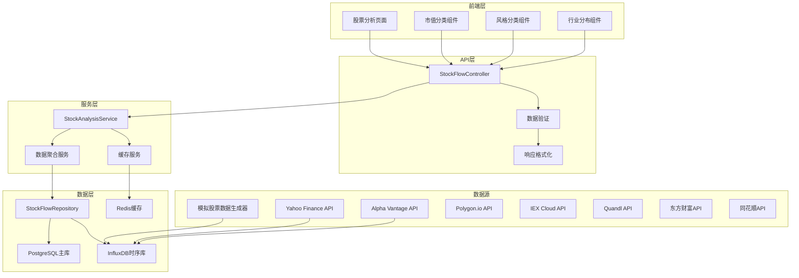

# US-002B-1: 股票类别资金流向分析 - 详细设计

## 功能概述

### 用户故事
**作为** 投资经理  
**我希望** 查看股票类别的资金流向数据  
**以便于** 了解全球股市的资金配置情况

### 验收标准
1. 显示全球主要股市的净流入/流出总额
2. 按市值分类（大盘股、中小盘股）的资金流向
3. 成长股vs价值股的资金流向对比
4. 主要行业板块的资金流入流出情况
5. 无数据时显示友好提示

## 技术设计

### 系统架构图



## 数据模型设计

### 核心实体类

#### 1. StockFlow（股票资金流动实体）
```java
@Entity
@Table(name = "stock_flows")
public class StockFlow {
    @Id
    private String id;
    
    // 基础信息
    private String symbol;          // 股票代码
    private String name;            // 股票名称
    private String exchange;        // 交易所
    private String region;          // 地区
    
    // 分类信息
    @Enumerated(EnumType.STRING)
    private MarketCapType marketCapType;  // 市值分类
    
    @Enumerated(EnumType.STRING)
    private StyleType styleType;          // 风格分类
    
    private String sector;                // 行业板块
    private String industry;              // 具体行业
    
    // 资金流动数据
    private BigDecimal netInflow;         // 净流入金额（美元）
    private BigDecimal buyVolume;         // 买入量
    private BigDecimal sellVolume;        // 卖出量
    private BigDecimal totalVolume;       // 总交易量
    
    // 时间和元数据
    private LocalDateTime timestamp;      // 时间戳
    private String dataSource;           // 数据来源
    private String methodology;          // 计算方法
    
    // 构造函数、getter、setter...
}
```

#### 2. 枚举类定义
```java
// 市值分类
public enum MarketCapType {
    LARGE_CAP("大盘股", "> 100亿美元"),
    MID_CAP("中盘股", "20-100亿美元"),
    SMALL_CAP("小盘股", "< 20亿美元");
    
    private final String displayName;
    private final String description;
}

// 风格分类
public enum StyleType {
    GROWTH("成长股", "高增长预期"),
    VALUE("价值股", "低估值"),
    BLEND("混合型", "成长价值均衡");
    
    private final String displayName;
    private final String description;
}

// 主要行业板块
public enum SectorType {
    TECHNOLOGY("科技"),
    HEALTHCARE("医疗保健"),
    FINANCIAL("金融"),
    CONSUMER_DISCRETIONARY("消费"),
    INDUSTRIALS("工业"),
    ENERGY("能源"),
    UTILITIES("公用事业"),
    MATERIALS("材料"),
    REAL_ESTATE("房地产"),
    TELECOM("电信");
}
```

#### 3. 聚合分析结果实体
```java
@Entity
@Table(name = "stock_analysis_results")
public class StockAnalysisResult {
    @Id
    private String id;
    
    @Enumerated(EnumType.STRING)
    private AnalysisType analysisType;    // 分析类型
    
    private String category;              // 分类（如LARGE_CAP, TECHNOLOGY等）
    private BigDecimal netInflow;         // 净流入
    private BigDecimal flowIntensity;     // 流向强度
    private Integer stockCount;           // 股票数量
    
    private LocalDateTime calculatedAt;   // 计算时间
    private LocalDateTime dataDate;       // 数据日期
    
    // 元数据
    private Map<String, Object> metadata; // 额外分析数据
}

public enum AnalysisType {
    MARKET_CAP_ANALYSIS("按市值分析"),
    STYLE_ANALYSIS("按风格分析"),
    SECTOR_ANALYSIS("按行业分析"),
    OVERALL_ANALYSIS("总体分析");
}
```

## API设计

### REST API接口

#### 1. 股票总体分析接口
```http
GET /api/v1/stocks/analysis/overview
```

**响应示例:**
```json
{
  "success": true,
  "data": {
    "summary": {
      "totalNetInflow": 1500000000,
      "totalVolume": 50000000000,
      "flowIntensity": 3.0,
      "activeStocks": 2847,
      "lastUpdated": "2025-01-17T15:30:00Z"
    },
    "topFlows": [
      {
        "symbol": "AAPL",
        "name": "Apple Inc",
        "netInflow": 200000000,
        "sector": "TECHNOLOGY"
      }
    ]
  }
}
```

#### 2. 按市值分类分析接口
```http
GET /api/v1/stocks/analysis/market-cap
```

**响应示例:**
```json
{
  "success": true,
  "data": {
    "marketCapAnalysis": {
      "LARGE_CAP": {
        "netInflow": 800000000,
        "stockCount": 500,
        "flowIntensity": 2.5,
        "percentage": 53.3
      },
      "MID_CAP": {
        "netInflow": 500000000,
        "stockCount": 1200,
        "flowIntensity": 3.2,
        "percentage": 33.3
      },
      "SMALL_CAP": {
        "netInflow": 200000000,
        "stockCount": 1147,
        "flowIntensity": 4.1,
        "percentage": 13.4
      }
    },
    "metadata": {
      "calculationMethod": "基于成交额加权平均",
      "dataSource": "实时交易数据",
      "lastUpdated": "2025-01-17T15:30:00Z"
    }
  }
}
```

#### 3. 按风格分类分析接口
```http
GET /api/v1/stocks/analysis/style
```

**响应示例:**
```json
{
  "success": true,
  "data": {
    "styleAnalysis": {
      "GROWTH": {
        "netInflow": 900000000,
        "stockCount": 1200,
        "avgPE": 28.5,
        "percentage": 60.0
      },
      "VALUE": {
        "netInflow": 600000000,
        "stockCount": 1500,
        "avgPE": 15.2,
        "percentage": 40.0
      }
    },
    "comparison": {
      "growthVsValue": {
        "ratio": 1.5,
        "trend": "成长股资金流入更强"
      }
    }
  }
}
```

#### 4. 按行业分析接口
```http
GET /api/v1/stocks/analysis/sectors
```

**响应示例:**
```json
{
  "success": true,
  "data": {
    "sectorAnalysis": [
      {
        "sector": "TECHNOLOGY",
        "netInflow": 400000000,
        "stockCount": 320,
        "flowIntensity": 4.2,
        "percentage": 26.7,
        "topStocks": ["AAPL", "MSFT", "GOOGL"]
      },
      {
        "sector": "HEALTHCARE", 
        "netInflow": 300000000,
        "stockCount": 280,
        "flowIntensity": 3.1,
        "percentage": 20.0,
        "topStocks": ["JNJ", "PFE", "UNH"]
      }
    ],
    "sectorRotation": {
      "inflow": ["TECHNOLOGY", "HEALTHCARE"],
      "outflow": ["ENERGY", "UTILITIES"]
    }
  }
}
```

## 业务逻辑设计

### 1. StockAnalysisService（核心服务类）

```java
@Service
@Transactional
public class StockAnalysisService {
    
    @Autowired
    private StockFlowRepository stockFlowRepository;
    
    @Autowired
    private RedisTemplate<String, Object> redisTemplate;
    
    /**
     * 获取股票总体分析
     */
    public StockOverviewResponse getStockOverview() {
        // 1. 检查缓存
        String cacheKey = "stock:overview:" + LocalDate.now();
        StockOverviewResponse cached = (StockOverviewResponse) 
            redisTemplate.opsForValue().get(cacheKey);
        if (cached != null) {
            return cached;
        }
        
        // 2. 计算总体指标
        BigDecimal totalNetInflow = stockFlowRepository.getTotalNetInflow();
        BigDecimal totalVolume = stockFlowRepository.getTotalVolume();
        Long activeStocks = stockFlowRepository.getActiveStockCount();
        
        // 3. 计算流向强度
        BigDecimal flowIntensity = calculateFlowIntensity(totalNetInflow, totalVolume);
        
        // 4. 获取资金流向最大的股票
        List<TopStockFlow> topFlows = stockFlowRepository.getTopFlows(10);
        
        // 5. 构建响应
        StockOverviewResponse response = StockOverviewResponse.builder()
            .totalNetInflow(totalNetInflow)
            .totalVolume(totalVolume)
            .flowIntensity(flowIntensity)
            .activeStocks(activeStocks)
            .topFlows(topFlows)
            .lastUpdated(LocalDateTime.now())
            .build();
        
        // 6. 缓存结果（5分钟）
        redisTemplate.opsForValue().set(cacheKey, response, 5, TimeUnit.MINUTES);
        
        return response;
    }
    
    /**
     * 按市值分类分析
     */
    public MarketCapAnalysisResponse getMarketCapAnalysis() {
        // 1. 查询各市值类别的数据
        Map<MarketCapType, MarketCapData> analysis = new HashMap<>();
        
        for (MarketCapType capType : MarketCapType.values()) {
            MarketCapData data = stockFlowRepository.getMarketCapData(capType);
            analysis.put(capType, data);
        }
        
        // 2. 计算百分比
        BigDecimal totalInflow = analysis.values().stream()
            .map(MarketCapData::getNetInflow)
            .reduce(BigDecimal.ZERO, BigDecimal::add);
            
        analysis.forEach((type, data) -> {
            BigDecimal percentage = data.getNetInflow()
                .divide(totalInflow, 2, RoundingMode.HALF_UP)
                .multiply(BigDecimal.valueOf(100));
            data.setPercentage(percentage);
        });
        
        return new MarketCapAnalysisResponse(analysis);
    }
    
    /**
     * 按风格分类分析
     */
    public StyleAnalysisResponse getStyleAnalysis() {
        // 实现成长股vs价值股分析
        // ...
    }
    
    /**
     * 按行业分析
     */
    public SectorAnalysisResponse getSectorAnalysis() {
        // 实现行业板块分析
        // ...
    }
    
    /**
     * 计算流向强度指数
     * 公式: (净流入金额 / 总成交金额) × 100
     */
    private BigDecimal calculateFlowIntensity(BigDecimal netInflow, BigDecimal totalVolume) {
        if (totalVolume.equals(BigDecimal.ZERO)) {
            return BigDecimal.ZERO;
        }
        return netInflow.divide(totalVolume, 4, RoundingMode.HALF_UP)
                       .multiply(BigDecimal.valueOf(100));
    }
}
```

### 2. 数据访问层设计

```java
@Repository
public interface StockFlowRepository extends JpaRepository<StockFlow, String> {
    
    /**
     * 获取总净流入
     */
    @Query("SELECT SUM(s.netInflow) FROM StockFlow s WHERE s.timestamp >= :startTime")
    BigDecimal getTotalNetInflow(@Param("startTime") LocalDateTime startTime);
    
    /**
     * 按市值类别查询
     */
    @Query("SELECT s.marketCapType, SUM(s.netInflow), COUNT(s), AVG(s.flowIntensity) " +
           "FROM StockFlow s WHERE s.timestamp >= :startTime " +
           "GROUP BY s.marketCapType")
    List<Object[]> getMarketCapAnalysis(@Param("startTime") LocalDateTime startTime);
    
    /**
     * 按风格分类查询
     */
    @Query("SELECT s.styleType, SUM(s.netInflow), COUNT(s) " +
           "FROM StockFlow s WHERE s.timestamp >= :startTime " +
           "GROUP BY s.styleType")
    List<Object[]> getStyleAnalysis(@Param("startTime") LocalDateTime startTime);
    
    /**
     * 按行业查询
     */
    @Query("SELECT s.sector, SUM(s.netInflow), COUNT(s) " +
           "FROM StockFlow s WHERE s.timestamp >= :startTime " +
           "GROUP BY s.sector ORDER BY SUM(s.netInflow) DESC")
    List<Object[]> getSectorAnalysis(@Param("startTime") LocalDateTime startTime);
    
    /**
     * 获取资金流向前N的股票
     */
    @Query("SELECT s FROM StockFlow s WHERE s.timestamp >= :startTime " +
           "ORDER BY s.netInflow DESC")
    List<StockFlow> getTopFlows(@Param("startTime") LocalDateTime startTime, Pageable pageable);
}
```

## 前端组件设计

### 1. 主页面组件结构

```typescript
// StockAnalysisPage.tsx
interface StockAnalysisPageProps {}

const StockAnalysisPage: React.FC<StockAnalysisPageProps> = () => {
  return (
    <div className="stock-analysis-page">
      <PageHeader title="股票类别资金流向分析" />
      
      {/* 总体概览 */}
      <StockOverviewCard />
      
      {/* 分析维度切换 */}
      <AnalysisTabs>
        <TabPane tab="市值分类" key="marketCap">
          <MarketCapAnalysis />
        </TabPane>
        <TabPane tab="投资风格" key="style">
          <StyleAnalysis />
        </TabPane>
        <TabPane tab="行业分布" key="sector">
          <SectorAnalysis />
        </TabPane>
      </AnalysisTabs>
    </div>
  );
};
```

### 2. 核心组件设计

#### StockOverviewCard（总体概览卡片）
```typescript
interface StockOverviewData {
  totalNetInflow: number;
  totalVolume: number;
  flowIntensity: number;
  activeStocks: number;
  lastUpdated: string;
}

const StockOverviewCard: React.FC = () => {
  const [data, setData] = useState<StockOverviewData | null>(null);
  const [loading, setLoading] = useState(true);
  
  useEffect(() => {
    fetchStockOverview();
  }, []);
  
  return (
    <Card title="股票市场总体概览" loading={loading}>
      <Row gutter={16}>
        <Col span={6}>
          <Statistic 
            title="净流入总额" 
            value={data?.totalNetInflow} 
            precision={0}
            suffix="美元"
            valueStyle={{ color: data?.totalNetInflow > 0 ? '#3f8600' : '#cf1322' }}
          />
        </Col>
        <Col span={6}>
          <Statistic 
            title="总交易量" 
            value={data?.totalVolume} 
            precision={0}
            suffix="美元"
          />
        </Col>
        <Col span={6}>
          <Statistic 
            title="流向强度" 
            value={data?.flowIntensity} 
            precision={2}
            suffix="%"
          />
        </Col>
        <Col span={6}>
          <Statistic 
            title="活跃股票数" 
            value={data?.activeStocks} 
            suffix="只"
          />
        </Col>
      </Row>
    </Card>
  );
};
```

#### MarketCapAnalysis（市值分类分析）
```typescript
const MarketCapAnalysis: React.FC = () => {
  const [data, setData] = useState(null);
  
  const chartData = [
    { name: '大盘股', value: data?.LARGE_CAP?.netInflow, percentage: data?.LARGE_CAP?.percentage },
    { name: '中盘股', value: data?.MID_CAP?.netInflow, percentage: data?.MID_CAP?.percentage },
    { name: '小盘股', value: data?.SMALL_CAP?.netInflow, percentage: data?.SMALL_CAP?.percentage },
  ];
  
  return (
    <Row gutter={16}>
      <Col span={12}>
        {/* 饼图显示资金分布 */}
        <Card title="按市值分类资金分布">
          <PieChart data={chartData} />
        </Card>
      </Col>
      <Col span={12}>
        {/* 柱状图显示流向强度 */}
        <Card title="各类别流向强度对比">
          <BarChart data={intensityData} />
        </Card>
      </Col>
    </Row>
  );
};
```

## 真实数据获取方案

### 数据源选择和对比

#### 1. 免费数据源

##### Yahoo Finance API
```java
// 优点：免费、数据丰富、全球覆盖
// 缺点：非官方API、可能被限制
// 数据类型：股价、成交量、基本面数据

@Service
public class YahooFinanceAdapter implements DataSourceAdapter {
    
    private final String BASE_URL = "https://query1.finance.yahoo.com/v8/finance/chart/";
    
    public Flux<RawDataPoint> collectData(DataSourceConfig config) {
        return WebClient.create()
            .get()
            .uri(BASE_URL + config.getSymbol())
            .retrieve()
            .bodyToMono(YahooFinanceResponse.class)
            .map(this::convertToRawDataPoint)
            .flux();
    }
}
```

##### Alpha Vantage API（推荐用于开发）
```java
// 优点：官方支持、稳定、有免费额度
// 缺点：免费版限制每分钟5次请求
// 获取方式：https://www.alphavantage.co/support/#api-key

@Service
public class AlphaVantageAdapter implements DataSourceAdapter {
    
    @Value("${alphavantage.api.key}")
    private String apiKey;
    
    private final String BASE_URL = "https://www.alphavantage.co/query";
    
    public StockData getStockData(String symbol) {
        MultiValueMap<String, String> params = new LinkedMultiValueMap<>();
        params.add("function", "GLOBAL_QUOTE");
        params.add("symbol", symbol);
        params.add("apikey", apiKey);
        
        return webClient.get()
            .uri(uriBuilder -> uriBuilder
                .scheme("https")
                .host("www.alphavantage.co")
                .path("/query")
                .queryParams(params)
                .build())
            .retrieve()
            .bodyToMono(AlphaVantageResponse.class)
            .map(this::parseStockData)
            .block();
    }
}
```

##### IEX Cloud API
```java
// 优点：专业级金融数据、有免费层
// 缺点：主要覆盖美国市场
// 获取方式：https://iexcloud.io/

@Service 
public class IEXCloudAdapter implements DataSourceAdapter {
    
    @Value("${iex.api.token}")
    private String token;
    
    private final String BASE_URL = "https://cloud.iexapis.com/stable/stock/";
    
    public CompletableFuture<List<StockFlow>> getBatchQuotes(List<String> symbols) {
        String symbolsParam = String.join(",", symbols);
        
        return webClient.get()
            .uri(BASE_URL + "market/batch?symbols={symbols}&types=quote&token={token}",
                 symbolsParam, token)
            .retrieve()
            .bodyToMono(Map.class)
            .map(this::convertBatchResponse)
            .toFuture();
    }
}
```

#### 2. 付费数据源（生产环境推荐）

##### Polygon.io API
```java
// 优点：实时数据、历史数据丰富、专业级
// 费用：$99/月起
// 特点：毫秒级实时数据、支持WebSocket

@Service
public class PolygonAdapter implements DataSourceAdapter {
    
    @Value("${polygon.api.key}")
    private String apiKey;
    
    // 实时股票数据
    public Flux<StockTick> getRealTimeData(String symbol) {
        return webSocketClient
            .connect("wss://socket.polygon.io/stocks")
            .flatMapMany(session -> {
                // 认证
                session.send(Mono.just(session.textMessage(
                    "{\"action\":\"auth\",\"params\":\"" + apiKey + "\"}")));
                
                // 订阅
                session.send(Mono.just(session.textMessage(
                    "{\"action\":\"subscribe\",\"params\":\"T." + symbol + "\"}")));
                
                return session.receive()
                    .map(WebSocketMessage::getPayloadAsText)
                    .map(this::parseStockTick);
            });
    }
    
    // 聚合数据（用于计算资金流）
    public StockAggregates getDailyAggregates(String symbol, LocalDate date) {
        String url = "https://api.polygon.io/v2/aggs/ticker/{symbol}/range/1/day/{date}/{date}";
        
        return webClient.get()
            .uri(url + "?apikey=" + apiKey, symbol, date.toString())
            .retrieve()
            .bodyToMono(PolygonAggregatesResponse.class)
            .map(this::convertToStockAggregates)
            .block();
    }
}
```

##### Quandl API (现在是Nasdaq Data Link)
```java
// 优点：高质量历史数据、多种数据集
// 费用：按数据集收费
// 特点：经济数据、另类数据

@Service
public class QuandlAdapter implements DataSourceAdapter {
    
    @Value("${quandl.api.key}")
    private String apiKey;
    
    public HistoricalData getHistoricalData(String symbol, LocalDate start, LocalDate end) {
        return webClient.get()
            .uri("https://data.nasdaq.com/api/v3/datasets/WIKI/{symbol}/data.json" +
                 "?start_date={start}&end_date={end}&api_key={key}",
                 symbol, start.toString(), end.toString(), apiKey)
            .retrieve()
            .bodyToMono(QuandlResponse.class)
            .map(this::convertToHistoricalData)
            .block();
    }
}
```

#### 3. 中国市场数据源

##### 东方财富API（非官方）
```java
// 适用于A股数据
// 免费但不稳定，需要处理反爬机制

@Service
public class EastMoneyAdapter implements DataSourceAdapter {
    
    private final String STOCK_FLOW_URL = "http://push2his.eastmoney.com/api/qt/stock/fflow/kline/get";
    
    public StockFlowData getStockFlow(String symbol) {
        MultiValueMap<String, String> params = new LinkedMultiValueMap<>();
        params.add("secid", convertToSecid(symbol)); // 转换股票代码格式
        params.add("klt", "101"); // 日线
        params.add("fqt", "1");
        params.add("fields1", "f1,f2,f3,f7");
        params.add("fields2", "f51,f52,f53,f54,f55,f56,f57,f58,f59,f60,f61,f62,f63");
        
        return webClient.get()
            .uri(uriBuilder -> uriBuilder
                .scheme("http")
                .host("push2his.eastmoney.com")
                .path("/api/qt/stock/fflow/kline/get")
                .queryParams(params)
                .build())
            .header("User-Agent", "Mozilla/5.0 (Windows NT 10.0; Win64; x64) AppleWebKit/537.36")
            .retrieve()
            .bodyToMono(EastMoneyResponse.class)
            .map(this::parseFlowData)
            .block();
    }
}
```

##### 同花顺API集成
```java
// 需要申请开发者账号
// 提供专业的A股数据服务

@Service
public class ThsAdapter implements DataSourceAdapter {
    
    @Value("${ths.app.id}")
    private String appId;
    
    @Value("${ths.app.secret}")
    private String appSecret;
    
    public TokenResponse getAccessToken() {
        Map<String, String> body = Map.of(
            "appid", appId,
            "appsecret", appSecret
        );
        
        return webClient.post()
            .uri("https://ft.10jqka.com.cn/api/v1/get_token")
            .bodyValue(body)
            .retrieve()
            .bodyToMono(TokenResponse.class)
            .block();
    }
}
```

### 资金流计算方法论

#### 1. 基于成交明细的计算（最准确）
```java
@Service
public class CashFlowCalculator {
    
    /**
     * 基于逐笔成交数据计算净流入
     * 需要获取每笔交易的主动买卖方向
     */
    public BigDecimal calculateNetInflow(List<TradeDetail> trades) {
        BigDecimal buyAmount = BigDecimal.ZERO;
        BigDecimal sellAmount = BigDecimal.ZERO;
        
        for (TradeDetail trade : trades) {
            if (trade.getDirection() == TradeDirection.BUY) {
                // 主动买入：按卖价成交
                buyAmount = buyAmount.add(trade.getAmount());
            } else if (trade.getDirection() == TradeDirection.SELL) {
                // 主动卖出：按买价成交
                sellAmount = sellAmount.add(trade.getAmount());
            }
        }
        
        return buyAmount.subtract(sellAmount);
    }
    
    /**
     * 通过价格变化判断主动方向
     * 如果无法获取明细数据的替代方案
     */
    public TradeDirection inferDirection(BigDecimal currentPrice, BigDecimal prevPrice) {
        if (currentPrice.compareTo(prevPrice) > 0) {
            return TradeDirection.BUY; // 价格上涨，可能是主动买入
        } else if (currentPrice.compareTo(prevPrice) < 0) {
            return TradeDirection.SELL; // 价格下跌，可能是主动卖出
        } else {
            return TradeDirection.NEUTRAL; // 价格不变
        }
    }
}
```

#### 2. 基于成交量加权的估算
```java
/**
 * 当无法获取逐笔数据时的估算方法
 * 基于价格变化和成交量的加权计算
 */
public BigDecimal estimateNetInflow(OHLCV candle, OHLCV prevCandle) {
    BigDecimal volume = candle.getVolume();
    BigDecimal avgPrice = candle.getClose().add(candle.getOpen()).divide(BigDecimal.valueOf(2));
    BigDecimal totalAmount = volume.multiply(avgPrice);
    
    // 基于收盘价变化分配买卖比例
    BigDecimal priceChange = candle.getClose().subtract(prevCandle.getClose());
    BigDecimal changePercent = priceChange.divide(prevCandle.getClose(), 4, RoundingMode.HALF_UP);
    
    // 简化算法：价格上涨越多，买入占比越高
    BigDecimal buyRatio = BigDecimal.valueOf(0.5).add(changePercent.multiply(BigDecimal.valueOf(0.5)));
    buyRatio = buyRatio.max(BigDecimal.ZERO).min(BigDecimal.ONE);
    
    BigDecimal buyAmount = totalAmount.multiply(buyRatio);
    BigDecimal sellAmount = totalAmount.subtract(buyAmount);
    
    return buyAmount.subtract(sellAmount);
}
```

### 数据适配器统一接口

```java
@Component
public class DataSourceManager {
    
    private final List<DataSourceAdapter> adapters;
    
    /**
     * 多源数据获取和验证
     */
    public StockFlowData getStockFlowWithFallback(String symbol) {
        for (DataSourceAdapter adapter : adapters) {
            try {
                StockFlowData data = adapter.getStockFlow(symbol);
                if (validateData(data)) {
                    return data;
                }
            } catch (Exception e) {
                log.warn("数据源 {} 获取失败: {}", adapter.getClass().getSimpleName(), e.getMessage());
            }
        }
        
        throw new DataSourceException("所有数据源都无法获取股票数据: " + symbol);
    }
    
    /**
     * 多源数据交叉验证
     */
    public StockFlowData getCrossValidatedData(String symbol) {
        List<StockFlowData> results = adapters.parallelStream()
            .map(adapter -> {
                try {
                    return adapter.getStockFlow(symbol);
                } catch (Exception e) {
                    return null;
                }
            })
            .filter(Objects::nonNull)
            .collect(Collectors.toList());
        
        if (results.size() < 2) {
            throw new ValidationException("无法获取足够的数据源进行交叉验证");
        }
        
        return selectBestData(results);
    }
}
```

### 配置和环境变量

```yaml
# application.yml
data-sources:
  alpha-vantage:
    enabled: true
    api-key: ${ALPHA_VANTAGE_API_KEY:demo}
    rate-limit: 5 # 每分钟请求数
    
  iex-cloud:
    enabled: true
    token: ${IEX_CLOUD_TOKEN:}
    base-url: https://cloud.iexapis.com/stable
    
  polygon:
    enabled: false # 付费服务，默认关闭
    api-key: ${POLYGON_API_KEY:}
    websocket-url: wss://socket.polygon.io/stocks
    
  yahoo-finance:
    enabled: true
    rate-limit: 2000 # 每小时请求数
    user-agent: "Mozilla/5.0 (compatible; CashFlowBot/1.0)"
    
  east-money:
    enabled: true
    rate-limit: 100
    headers:
      User-Agent: "Mozilla/5.0 (Windows NT 10.0; Win64; x64) AppleWebKit/537.36"
      Referer: "http://quote.eastmoney.com/"

# 数据质量配置
data-quality:
  max-price-change: 0.2 # 单日最大价格变化阈值
  min-volume: 1000      # 最小成交量要求
  validation-sources: 2  # 需要的验证数据源数量
```

### 数据获取示例代码

```java
@RestController
@RequestMapping("/api/v1/data-sources")
public class DataSourceTestController {
    
    @Autowired
    private DataSourceManager dataSourceManager;
    
    /**
     * 测试数据源连接
     */
    @GetMapping("/test/{symbol}")
    public ResponseEntity<Map<String, Object>> testDataSource(@PathVariable String symbol) {
        Map<String, Object> result = new HashMap<>();
        
        try {
            // 测试Alpha Vantage
            StockFlowData alphaData = alphaVantageAdapter.getStockFlow(symbol);
            result.put("alpha_vantage", Map.of(
                "status", "success",
                "price", alphaData.getPrice(),
                "volume", alphaData.getVolume()
            ));
        } catch (Exception e) {
            result.put("alpha_vantage", Map.of("status", "error", "message", e.getMessage()));
        }
        
        try {
            // 测试Yahoo Finance
            StockFlowData yahooData = yahooFinanceAdapter.getStockFlow(symbol);
            result.put("yahoo_finance", Map.of(
                "status", "success",
                "price", yahooData.getPrice(),
                "volume", yahooData.getVolume()
            ));
        } catch (Exception e) {
            result.put("yahoo_finance", Map.of("status", "error", "message", e.getMessage()));
        }
        
        return ResponseEntity.ok(result);
    }
}
```

## 数据生成和模拟

### 模拟数据生成器（开发测试用）

```java
@Component
public class StockDataGenerator {
    
    private final StockFlowRepository repository;
    private final Random random = new Random();
    
    /**
     * 生成模拟股票数据
     */
    @Scheduled(fixedRate = 30000) // 每30秒生成一次
    public void generateMockData() {
        List<StockFlow> flows = new ArrayList<>();
        
        // 生成主要股票的数据
        for (String symbol : getMajorStocks()) {
            StockFlow flow = createMockStockFlow(symbol);
            flows.add(flow);
        }
        
        repository.saveAll(flows);
        log.info("Generated {} mock stock flows", flows.size());
    }
    
    private StockFlow createMockStockFlow(String symbol) {
        StockInfo info = getStockInfo(symbol);
        
        return StockFlow.builder()
            .id(UUID.randomUUID().toString())
            .symbol(symbol)
            .name(info.getName())
            .exchange(info.getExchange())
            .region(info.getRegion())
            .marketCapType(info.getMarketCapType())
            .styleType(info.getStyleType())
            .sector(info.getSector())
            .netInflow(generateNetInflow())
            .buyVolume(generateVolume())
            .sellVolume(generateVolume())
            .timestamp(LocalDateTime.now())
            .dataSource("MOCK_GENERATOR")
            .build();
    }
    
    private List<String> getMajorStocks() {
        return Arrays.asList(
            "AAPL", "MSFT", "GOOGL", "AMZN", "TSLA",
            "META", "NVDA", "JPM", "JNJ", "PG",
            "V", "UNH", "HD", "DIS", "MA"
        );
    }
}
```

## 错误处理和验证

### 1. 全局异常处理
```java
@ControllerAdvice
public class StockAnalysisExceptionHandler {
    
    @ExceptionHandler(DataNotFoundException.class)
    public ResponseEntity<ErrorResponse> handleDataNotFound(DataNotFoundException ex) {
        ErrorResponse error = ErrorResponse.builder()
            .code("STOCK_DATA_NOT_FOUND")
            .message("暂无股票数据")
            .suggestion("请稍后重试或查看总体股市数据")
            .timestamp(LocalDateTime.now())
            .build();
        return ResponseEntity.ok(error);
    }
    
    @ExceptionHandler(AnalysisException.class)
    public ResponseEntity<ErrorResponse> handleAnalysisError(AnalysisException ex) {
        ErrorResponse error = ErrorResponse.builder()
            .code("ANALYSIS_ERROR")
            .message("数据分析出现错误")
            .suggestion("请检查数据完整性")
            .timestamp(LocalDateTime.now())
            .build();
        return ResponseEntity.status(500).body(error);
    }
}
```

### 2. 数据验证
```java
@Service
public class StockDataValidator {
    
    public boolean validateStockFlow(StockFlow flow) {
        // 1. 基础字段验证
        if (StringUtils.isEmpty(flow.getSymbol())) {
            throw new ValidationException("股票代码不能为空");
        }
        
        // 2. 数值范围验证
        if (flow.getNetInflow() != null && 
            flow.getNetInflow().abs().compareTo(BigDecimal.valueOf(1e12)) > 0) {
            throw new ValidationException("净流入数值异常");
        }
        
        // 3. 时间戳验证
        if (flow.getTimestamp().isBefore(LocalDateTime.now().minusDays(1))) {
            log.warn("股票数据时间戳过旧: {}", flow.getTimestamp());
        }
        
        return true;
    }
}
```

## 性能优化

### 1. 缓存策略
- **总体数据**: 缓存5分钟
- **分类分析**: 缓存10分钟  
- **历史数据**: 缓存1小时

### 2. 数据库优化
```sql
-- 为股票流数据创建复合索引
CREATE INDEX idx_stock_flows_timestamp_symbol ON stock_flows(timestamp, symbol);
CREATE INDEX idx_stock_flows_market_cap_timestamp ON stock_flows(market_cap_type, timestamp);
CREATE INDEX idx_stock_flows_sector_timestamp ON stock_flows(sector, timestamp);
```

### 3. 查询优化
- 使用数据库聚合函数减少数据传输
- 分页查询大结果集
- 预计算常用指标

## 测试策略

### 1. 单元测试
```java
@ExtendWith(MockitoExtension.class)
class StockAnalysisServiceTest {
    
    @Mock
    private StockFlowRepository repository;
    
    @InjectMocks
    private StockAnalysisService service;
    
    @Test
    void should_return_stock_overview_when_data_exists() {
        // Given
        when(repository.getTotalNetInflow()).thenReturn(BigDecimal.valueOf(1000000));
        
        // When
        StockOverviewResponse response = service.getStockOverview();
        
        // Then
        assertThat(response.getTotalNetInflow()).isEqualTo(BigDecimal.valueOf(1000000));
    }
}
```

### 2. 集成测试
```java
@SpringBootTest
@AutoConfigureTestDatabase
class StockAnalysisIntegrationTest {
    
    @Test
    void should_return_market_cap_analysis_via_api() throws Exception {
        mockMvc.perform(get("/api/v1/stocks/analysis/market-cap"))
            .andExpect(status().isOk())
            .andExpect(jsonPath("$.success").value(true))
            .andExpect(jsonPath("$.data.marketCapAnalysis").exists());
    }
}
```

## 部署配置

### application.yml
```yaml
spring:
  datasource:
    url: jdbc:postgresql://localhost:5432/cashflow
    username: ${DB_USERNAME:cashflow}
    password: ${DB_PASSWORD:password}
  
  redis:
    host: localhost
    port: 6379
    timeout: 2000ms
  
  jpa:
    show-sql: false
    hibernate:
      ddl-auto: update

# 股票分析配置
stock:
  analysis:
    cache-duration: 300  # 缓存时长（秒）
    mock-data: true      # 是否启用模拟数据
    update-interval: 30  # 数据更新间隔（秒）
```

## 总结

这个设计为US-002B-1提供了完整的实现方案：

### 核心特性
1. **完整的数据模型** - 支持所有验收标准
2. **RESTful API** - 标准化的接口设计
3. **缓存优化** - 提高查询性能
4. **模拟数据** - 支持开发和测试
5. **错误处理** - 友好的错误提示
6. **前端组件** - 直观的数据展示

### 可扩展性
- 支持新增股票分类维度
- 支持接入真实数据源
- 支持更复杂的分析算法

### 下一步实施
1. 创建数据模型和实体类
2. 实现核心服务层
3. 开发REST API接口
4. 创建前端组件
5. 集成测试和部署

这个设计确保了US-002B-1能够完全满足验收标准，同时为后续功能扩展打下良好基础。